# Inc42 Data Warehouse — Detailed Architecture

## The Problem

> The same person exists in 7 different systems with no connection between them.
> The same company appears as "FreshKart", "FreshKart Pvt Ltd", "FreshKart Private Limited".
> Phone numbers stored in 5 different formats. Newsletter status duplicated 20+ times.

---

## 1. Where Our Data Lives Today

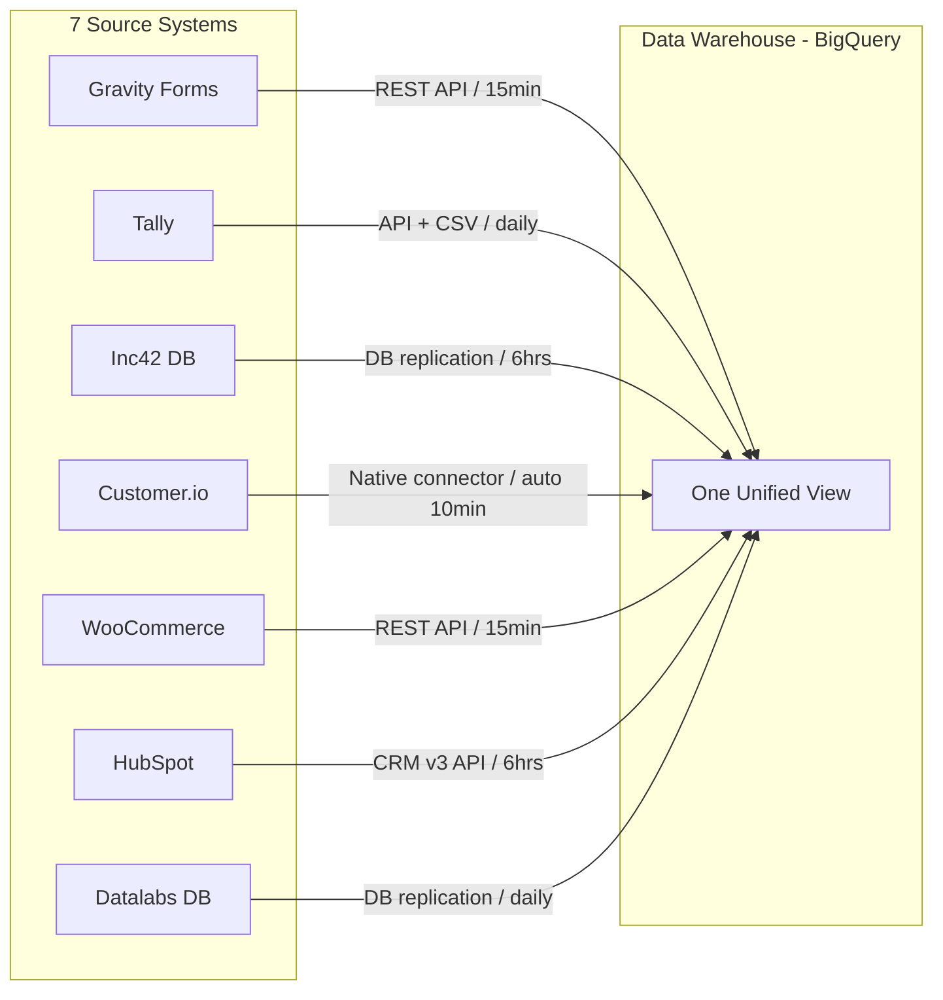

### What Each Source Provides

| Source | What It Captures | Example Data |
|--------|-----------------|--------------|
| **Gravity Forms** | Event registrations (AI Summit, D2C Summit, GenAI Summit, MoneyX), Startup applications (Griffin, Spotlight) | Name, email, phone, company, designation, ticket type |
| **Tally** | Workshop registrations (D2CX Converge), Surveys (Founder Survey, Investor Survey), Applications (Fast42, Startup Discovery) | Self-reported revenue, funding, valuation, team size, sector |
| **Inc42 DB** | Registered users, Newsletter preferences, Plus membership records, WordPress accounts | Email, password hash, account creation date, login history |
| **Customer.io** | Email campaigns (sent/opened/clicked/bounced), Push notifications, SMS/WhatsApp, 140+ user attributes, Page views | Engagement status, LTV, sessions, newsletter statuses, channel reachability |
| **WooCommerce** | Orders, Payments (Razorpay/Stripe), Refunds, Billing addresses, UTM tracking | Products, amounts, taxes, discounts, coupons, payment method |
| **HubSpot** | CRM contacts, Companies, Deals, Sales activities (calls/emails/meetings) | Lifecycle stage, lead score, deal amount, pipeline stage, owner |
| **Datalabs DB** | **25+ tables**: Company profiles, MCA financials (audited), Funding rounds, People (founders/CXOs), Investors, Web traffic, App metrics, Employee data, Glassdoor, Jobs, Stock data, Acquisitions | Revenue, expenses, EBITDA, margins, funding amounts, investor names, headcount, web visits, app ratings |

---

## 2. The Warehouse — Three Layers

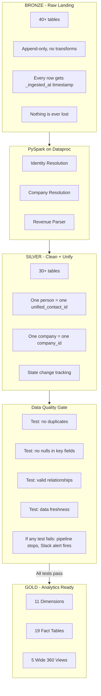

### What Happens in Each Layer

#### Bronze — Raw Landing
- Data lands **exactly as it came** from each source system
- No cleaning, no transformation, no deduplication
- Every row gets audit columns: `_ingested_at`, `_source_file`, `_ingestion_id`
- If the same file loads twice, we detect and deduplicate
- **Philosophy: never lose raw data**

#### PySpark on Dataproc — Heavy Compute
- **Identity Resolution**: Same person in 7 systems with different IDs, emails, phone formats → matched into one `unified_contact_id`
- **Company Resolution**: "FreshKart" / "FreshKart Pvt Ltd" / "FreshKart Private Limited" → matched to one Datalabs `company_id`
- **Revenue Parser**: "8 Cr" → 80,000,000 | "1.2 Crore (Seed)" → 12,000,000 | "80 Lakhs" → 8,000,000

#### Silver — Clean + Unify
- dbt Core SQL models run on BigQuery
- **Phone**: 11 different fields across systems → 1 field in E.164 format (`+919876543210`)
- **Email**: 12 fields → 1 canonical email
- **Company name**: Strip suffixes (Pvt Ltd, Private Limited, LLP)
- **City**: "Bangalore" → "Bengaluru", state codes "KA" → "Karnataka"
- **Newsletters**: 20+ duplicate Customer.io fields → 9 clean rows (one per newsletter)

#### Gold — Analytics Ready
- Star schema optimized for queries — **every query needs maximum 2 joins**
- 11 Dimensions (who/what/where/when/how)
- 19 Fact tables (one per business process)
- 5 Wide "360" views (one row = everything about an entity)

---

## 2.1 Silver Layer — All 30+ Tables in Detail

> Silver is where 7 messy systems become one clean, unified, queryable truth.
> Every table below is a dbt model — a SQL file that reads from Bronze and writes to BigQuery dataset `silver`.

### Core Identity Tables

These are the foundation — every other Silver table references these.

#### `silver.unified_contacts`
**What:** Master identity table. One row per real-world person.
**Source:** PySpark identity resolution output
**Why it exists:** Priya Sharma has 7 different IDs across 7 systems. This table says: "These 7 records are all the same person."

| Column | Example | Source |
|--------|---------|--------|
| unified_contact_id | a1b2c3d4-e5f6-7890 | PySpark-generated UUID |
| primary_email | priya@freshkart.in | Best email from resolution |
| primary_phone | +919876543210 | Best phone, E.164 normalized |
| match_confidence | 0.95 | How sure we are this is one person |
| created_at | 2024-06-12 09:30:00 | Earliest `first_seen` across all systems |

#### `silver.contact_source_xref`
**What:** Cross-reference mapping every source system ID to the unified ID.
**Source:** PySpark identity resolution output
**Why it exists:** When WooCommerce says "customer 88201 placed an order", this table tells us that's Priya (unified_contact_id = a1b2c3d4).

| Column | Example | Source |
|--------|---------|--------|
| unified_contact_id | a1b2c3d4 | Links to unified_contacts |
| source_system | woocommerce | Which system |
| source_id | 88201 | The ID in that system |
| match_method | email_exact | How the match was made |
| match_confidence | 1.0 | Exact email match = 100% confidence |

#### `silver.contacts`
**What:** Full cleaned profile for every person. THE main people table.
**Source:** All 7 Bronze tables, unified via contact_source_xref
**Why it exists:** Every downstream table (orders, events, newsletters) joins to this.

| Column | Example | How it's resolved |
|--------|---------|-------------------|
| unified_contact_id | a1b2c3d4 | From unified_contacts |
| email | priya@freshkart.in | COALESCE: HubSpot > Inc42 > Customer.io > WooCommerce > Tally > Gravity > Datalabs |
| phone | +919876543210 | COALESCE (same priority) + E.164 normalization |
| first_name | Priya | COALESCE: HubSpot > Customer.io > Inc42 > Gravity > Tally |
| last_name | Sharma | Same priority chain |
| full_name | Priya Sharma | CONCAT(first, last) or fallback to Customer.io `Name` field |
| designation | Co-Founder & CEO | COALESCE: HubSpot > Customer.io > Tally > Gravity |
| seniority | CXO | COALESCE: HubSpot > Customer.io |
| user_type | founder | Derived from designation + form context |
| company_name | FreshKart | Stripped of "Pvt Ltd" etc., matched to Datalabs |
| company_id | comp_uuid_001 | From company resolution |
| linkedin_url | linkedin.com/in/priya | COALESCE across 8 LinkedIn fields in Customer.io/HubSpot/forms |
| city | Bengaluru | Standardized: "Bangalore" → "Bengaluru" |
| state | Karnataka | Expanded: "KA" → "Karnataka" |
| country | India | Expanded: "IN" → "India" |
| pincode | 560102 | From Customer.io/forms |
| timezone_offset_mins | 330 | From Customer.io (IST = +5:30 = 330 min) |
| interests | [ai, d2c, funding] | From Customer.io traits |
| primary_source | inc42 | Which system first captured this person |
| first_seen_at | 2024-06-12 | Earliest date across all systems |
| last_seen_at | 2025-12-01 | Latest activity across all systems |

---

### Activity Tables — What People Did

#### `silver.orders`
**What:** Every purchase on Inc42 (Plus, Workshop tickets, Event tickets).
**Source:** `bronze.woocommerce_orders`
**Grain:** One row per order

| Column | Example | Transform |
|--------|---------|-----------|
| order_id | 88201 | Direct from WooCommerce |
| unified_contact_id | a1b2c3d4 | Matched via billing_email → contact_source_xref |
| order_date | 2025-11-18 | Direct |
| order_status | completed | LOWER(status) |
| order_total | 4999.00 | Direct |
| tax_total | 763.41 | Direct |
| discount_amount | 999.00 | Direct |
| net_revenue | 3236.59 | Computed: order_total - discount - tax |
| coupon_code | EARLY20 | Direct |
| payment_method | razorpay | Direct |
| billing_city | Bengaluru | Standardized |
| billing_state | Karnataka | Expanded from code |
| utm_source | google | From WooCommerce UTM tracking |
| utm_medium | cpc | From WooCommerce UTM tracking |
| utm_campaign | ai_workshop_nov25 | From WooCommerce UTM tracking |

#### `silver.order_line_items`
**What:** Individual products within each order.
**Source:** `bronze.woocommerce_orders` (line_items JSON)
**Grain:** One row per product per order

| Column | Example | Transform |
|--------|---------|-----------|
| line_item_id | 12001 | From line_items JSON |
| order_id | 88201 | FK to orders |
| product_id | 501 | From WooCommerce |
| product_name | AI Workshop Nov 2025 | Direct |
| sku | WKSHP-AI-NOV25 | Direct |
| quantity | 1 | Direct |
| unit_price | 5998.00 | Direct |
| line_total | 4999.00 | After discount applied |

#### `silver.refunds`
**What:** Refund records linked back to orders.
**Source:** `bronze.woocommerce_orders` (refund fields + WooCommerce refunds API)
**Grain:** One row per refund

| Column | Example | Transform |
|--------|---------|-----------|
| refund_id | REF-88201-001 | Generated or from WooCommerce |
| order_id | 88201 | FK to orders |
| unified_contact_id | a1b2c3d4 | From parent order |
| refund_date | 2025-11-25 | Direct |
| refund_amount | 2999.00 | Direct |
| refund_reason | schedule_conflict | From WooCommerce or manual tag |

#### `silver.form_submissions`
**What:** Every form submitted across Gravity and Tally.
**Source:** `bronze.gravity_forms` + `bronze.tally_forms`
**Grain:** One row per form submission

| Column | Example | Transform |
|--------|---------|-----------|
| submission_id | 1 (auto) | Auto-generated |
| unified_contact_id | a1b2c3d4 | Matched via email |
| form_name | AI Summit 2025 Registration | Gravity: form_name, Tally: form_name |
| form_type | event_registration | Derived: CASE WHEN form_name LIKE '%Summit%' THEN 'event_registration' WHEN LIKE '%Fast42%' THEN 'startup_application' WHEN LIKE '%Survey%' THEN 'survey' END |
| source_system | gravity | Which platform captured it |
| source_form_id | 12 | Original form ID |
| submitted_at | 2025-11-14 18:45:00 | Gravity: date_created, Tally: submitted_at |
| utm_source | newsletter_daily | From form UTM params |

#### `silver.event_registrations`
**What:** Every event registration with full lifecycle (registered → cancelled → attended → no-show).
**Source:** `bronze.gravity_forms` + `bronze.tally_forms` + `bronze.customerio_identify` (event flags) + `bronze.woocommerce_orders` (for ticket payments/refunds)
**Grain:** One row per person per event

| Column | Example | Transform |
|--------|---------|-----------|
| registration_id | 1 (auto) | Auto-generated |
| unified_contact_id | a1b2c3d4 | Matched via email |
| event_name | AI Summit 2025 | Gravity: event_name, Tally: from form_name, Customer.io: from boolean flags |
| event_type | summit | Derived from event_name |
| edition | 2025 | Extracted from form name or date |
| registration_date | 2025-11-14 | From form submission date |
| registration_type | paid | Gravity: ticket_type, Customer.io: IF _paid=TRUE → paid, _speaker=TRUE → speaker |
| registration_status | attended | Lifecycle: registered → cancelled → attended → no_show |
| cancellation_date | NULL | From WooCommerce refund date if cancelled |
| cancellation_reason | NULL | From WooCommerce or form data |
| days_before_event_cancelled | NULL | Computed: event_date - cancellation_date |
| ticket_amount | 4999.00 | Matched to WooCommerce order |
| refund_amount | 0.00 | From silver.refunds if cancelled |
| net_ticket_revenue | 4999.00 | ticket_amount - refund_amount |
| attended | TRUE | From Customer.io boolean flags (d2c_summit_paid_attendee etc.) |
| woo_order_id | 88201 | Matched to WooCommerce order by contact + event + date window |
| source_system | gravity | Which system captured registration |

#### `silver.newsletter_subscriptions`
**What:** One row per person per newsletter. Tracks subscription status for each of the 9 newsletters.
**Source:** `bronze.customerio_identify` (traits JSON — 20+ duplicate newsletter fields cleaned into 9)
**Grain:** One row per person per newsletter

| Column | Example | Transform |
|--------|---------|-----------|
| unified_contact_id | a1b2c3d4 | Matched via userId → xref |
| newsletter_name | daily | Canonical name: daily, weekly, ai_shift, indepth, theoutline, markets, moneyball, marketing, lead_magnet |
| status | subscribed | COALESCE of duplicate fields: e.g. for "daily" → COALESCE(Daily_Newsletter_Status, daily_newsletter_status, Inc42_Daily_Newsletter_Status, Inc42 Daily Newsletter Status) |
| subscribed_at | 2024-06-12 | From Customer.io first seen or trait timestamp |
| unsubscribed_at | NULL | NULL if still subscribed, date if unsubscribed |
| source_field | Daily_Newsletter_Status | Which Customer.io field had the value (for debugging) |

**Newsletter field deduplication map (20+ → 9):**

| Newsletter | Customer.io Fields That All Mean the Same Thing |
|---|---|
| daily | `Daily_Newsletter_Status`, `daily_newsletter_status`, `Inc42_Daily_Newsletter_Status`, `Inc42 Daily Newsletter Status` |
| indepth | `Inc42_In-Depth_Newsletter_Status`, `Inc42 In-Depth Newsletter Status`, `Indepth_Newsletter_Status`, `InDepth_Newsletter_Status`, `Indepth A/B` |
| markets | `Inc42_Markets_Status`, `Inc42_markets_status`, `Market_Newsletter_Status` |
| weekly | `Weekly_Newsletter_Status` |
| ai_shift | `Ai_Shift_Newsletter_Status` |
| theoutline | `TheOutline_Newsletter_Status` |
| moneyball | `moneyball_weekly_status` |
| marketing | `Marketing_Email_Status` |
| lead_magnet | `Lead_Magnet_Status`, `Lead_Magnet2_Status` |

#### `silver.plus_memberships`
**What:** Plus subscription lifecycle for each member.
**Source:** `bronze.customerio_identify` (Plus traits) + `bronze.woocommerce_orders` (payment records) + `bronze.inc42_registered_users`
**Grain:** One row per person per subscription

| Column | Example | Transform |
|--------|---------|-----------|
| unified_contact_id | a1b2c3d4 | Matched via email |
| subscription_id | sub_razorpay_abc123 | From Customer.io: Plus Subscription ID |
| membership_type | annual | From Customer.io: Plus Membership Type |
| start_date | 2025-01-15 | From Customer.io: Plus Membership Start Date |
| expiry_date | 2026-01-15 | From Customer.io: Plus Membership Expiry Date |
| next_payment_date | 2026-01-15 | From Customer.io: Plus Next Payment Date |
| status | active | Derived: IF cancellation_state IS NOT NULL AND expiry > today → 'active_cancelling', IF expiry < today → 'churned', ELSE 'active' |
| cancellation_state | NULL | From Customer.io: Plus Cancellation State |
| days_to_expiry | 303 | Computed: expiry_date - today |
| trial_end_date | NULL | From Customer.io: Trial End Date |
| amount_paid | 9999.00 | Matched from WooCommerce order |
| payment_method | razorpay | From WooCommerce order |
| conversion_id | conv_12345 | From Customer.io: Plus ConversionID |

#### `silver.marketing_engagement`
**What:** Email/push/SMS campaign interactions.
**Source:** `bronze.customerio_events` (track table — email opened, clicked, bounced, etc.)
**Grain:** One row per person per campaign per channel per day

| Column | Example | Transform |
|--------|---------|-----------|
| unified_contact_id | a1b2c3d4 | Matched via userId |
| channel | email | Derived from event properties |
| campaign_name | plus_renewal_dec25 | From event properties |
| activity_date | 2025-12-01 | From event timestamp, truncated to date |
| sent | 1 | 1 if "Email Sent" event exists, else 0 |
| delivered | 1 | 1 if "Email Delivered" event exists, else 0 |
| opened | 1 | 1 if "Email Opened" event exists, else 0 |
| clicked | 1 | 1 if "Email Clicked" event exists, else 0 |
| bounced | 0 | 1 if "Email Bounced" event exists, else 0 |
| unsubscribed | 0 | 1 if "Email Unsubscribed" event exists, else 0 |
| spam_reported | 0 | 1 if "Email Spam Reported" event exists, else 0 |

#### `silver.lead_lifecycle`
**What:** Tracks how a person moves through the sales pipeline over time.
**Source:** `bronze.hubspot_contacts` (lifecycle_stage, lead_status changes)
**Grain:** One row per stage transition

| Column | Example | Transform |
|--------|---------|-----------|
| unified_contact_id | a1b2c3d4 | Matched via email |
| from_stage | lead | Previous lifecycle_stage (via LAG window) |
| to_stage | opportunity | Current lifecycle_stage |
| transition_date | 2025-10-15 | When the stage changed |
| days_in_previous_stage | 424 | Computed: transition_date - previous transition_date |
| hubspot_score_at_change | 82 | HubSpot lead score at time of transition |
| deal_amount | 50000 | From HubSpot deal if associated |
| lead_owner | owner_jsingh | From HubSpot contact owner |

#### `silver.channel_reachability`
**What:** Which communication channels can reach this person right now.
**Source:** `bronze.customerio_identify` (reachability traits + bounce/unsub flags)
**Grain:** One row per person (latest snapshot)

| Column | Example | Transform |
|--------|---------|-----------|
| unified_contact_id | a1b2c3d4 | Matched via userId |
| email_reachable | TRUE | TRUE if: email exists AND Hard Bounce = FALSE AND global unsub = FALSE |
| email_hard_bounced | FALSE | From Customer.io: Hard Bounce |
| email_spam_reported | FALSE | From Customer.io: Spam |
| email_global_unsub | FALSE | From Customer.io: Unsubscribe |
| push_web | TRUE | From Customer.io: Reachability Push Web |
| push_android | FALSE | From Customer.io: Reachability Push Android |
| push_ios | FALSE | From Customer.io: Reachability Push iOS |
| sms_reachable | TRUE | From Customer.io: SMS Subscription Status = 'subscribed' |
| whatsapp_reachable | TRUE | From Customer.io: WhatsApp Subscription Status = 'subscribed' |
| total_reachable_channels | 4 | Computed: SUM of all TRUE channels |
| preferred_channel | email | Derived: first reachable in priority order: email > push > whatsapp > sms |

#### `silver.product_usage`
**What:** Tracks usage of Inc42 products (Datalabs, Courses).
**Source:** `bronze.customerio_identify` (Datalabs traits, course traits) + `bronze.inc42_registered_users`
**Grain:** One row per person per product

| Column | Example | Transform |
|--------|---------|-----------|
| unified_contact_id | a1b2c3d4 | Matched via email |
| product_name | datalabs | Canonical name: datalabs, inc42_courses |
| is_active | FALSE | From Customer.io: Datalabs Onboarding Complete, course enrollment status |
| use_case | competitor_tracking | From Customer.io: DL Use Case |
| onboarding_complete | FALSE | From Customer.io: Datalabs Onboarding Complete |
| course_name | NULL | From Customer.io: Inc42 Course Name |

---

### Company Tables — Powered by Datalabs

#### `silver.companies`
**What:** Master company profile. Datalabs is the backbone, enriched with HubSpot + Inc42 ecosystem data.
**Source:** `bronze.dl_company_table` + PySpark company resolution output + `bronze.hubspot_companies`
**Grain:** One row per company

| Column | Example | Transform |
|--------|---------|-----------|
| company_id | comp_uuid_001 | Datalabs company_uuid (source of truth) |
| company_name | FreshKart | From Datalabs |
| legal_name | FreshKart Private Limited | From Datalabs |
| domain | freshkart.in | From Datalabs website, stripped of https/www |
| website | https://freshkart.in | Direct |
| sector | Consumer Brands | From Datalabs |
| sub_sector | D2C | From Datalabs |
| sub_sector_2 | Personal Care | From Datalabs |
| business_model | B2C | From Datalabs |
| company_status | active | From Datalabs |
| ipo_status | not_listed | From Datalabs |
| founded_year | 2021 | From Datalabs |
| hq_city | Bengaluru | Standardized |
| hq_state | Karnataka | Expanded |
| hq_country | India | Expanded |
| founders | Priya Sharma, Arjun Mehta | From Datalabs people table |
| founder_count | 2 | Computed |
| female_founder_count | 1 | Computed from Datalabs people gender data |
| hubspot_company_id | 50012 | From PySpark company resolution xref |
| datalabs_profile_url | datalabs.inc42.com/startups/freshkart | Constructed |
| total_contacts_in_warehouse | 2 | Computed: COUNT contacts WHERE company_id = this |

#### `silver.company_financials`
**What:** MCA-audited financial data per company per fiscal year.
**Source:** `bronze.dl_profit_loss` + `bronze.dl_balance_sheet` + PySpark parsed revenues (for Tally self-reported data)
**Grain:** One row per company per fiscal year

| Column | Example | Transform |
|--------|---------|-----------|
| company_id | comp_uuid_001 | FK to companies |
| fiscal_year | FY25 | From Datalabs |
| revenue | 80000000 | Datalabs MCA (authoritative) or PySpark-parsed Tally self-reported |
| revenue_source | mca_filing | mca_filing (audited) or self_reported (from Tally) |
| expenses | 75800000 | From Datalabs P&L |
| ebitda | 7660000 | From Datalabs |
| pat (profit after tax) | 4200000 | From Datalabs P&L |
| is_profitable | TRUE | Computed: pat > 0 |
| gross_margin_pct | 60.0 | From Datalabs |
| net_margin_pct | 5.22 | Computed: pat / revenue × 100 |
| ebitda_margin_pct | 9.57 | Computed: ebitda / revenue × 100 |
| revenue_yoy_growth_pct | 220.0 | Computed: (current - previous) / previous × 100 |
| current_ratio | 2.91 | From Datalabs balance sheet |
| debt_equity_ratio | 0.10 | From Datalabs balance sheet |
| cash_balance | 9500000 | From Datalabs balance sheet |

#### `silver.company_funding_rounds`
**What:** Every funding round a company has raised.
**Source:** `bronze.dl_funding_table`
**Grain:** One row per funding round

| Column | Example | Transform |
|--------|---------|-----------|
| company_id | comp_uuid_001 | FK to companies |
| round_date | 2023-06-15 | From Datalabs |
| funding_stage | seed | LOWER standardized: Pre-Seed, Seed, Series A, Series B, etc. |
| amount_inr | 12000000 | From Datalabs, or PySpark-parsed if text |
| amount_usd | 144000 | Computed: amount_inr / exchange_rate |
| lead_investor | Titan Capital | From Datalabs |
| all_investors | Titan Capital, AngelList India, 2AM VC | From Datalabs |
| investor_count | 3 | Computed |
| source_url | livemint.com/article/... | From Datalabs (news source) |

#### `silver.company_investors`
**What:** Investor profiles and their portfolio.
**Source:** `bronze.dl_investor_table` + `bronze.dl_funding_table`
**Grain:** One row per investor

| Column | Example | Transform |
|--------|---------|-----------|
| investor_id | inv_uuid_001 | From Datalabs |
| investor_name | Titan Capital | From Datalabs |
| investor_type | angel_fund | LOWER standardized: angel, vc, pe, corporate, angel_fund |
| total_investments | 85 | Computed: COUNT from funding rounds |
| total_capital_deployed_inr | 150000000 | Computed: SUM from funding rounds |
| top_sectors | [Consumer Brands, Fintech, SaaS] | Computed: top 3 sectors by investment count |
| portfolio_companies | [FreshKart, PayEase, ...] | Computed from funding rounds |

#### `silver.company_people`
**What:** Key people (founders, CXOs, board members) at each company.
**Source:** `bronze.dl_people_table`
**Grain:** One row per person per company per role

| Column | Example | Transform |
|--------|---------|-----------|
| company_id | comp_uuid_001 | FK to companies |
| person_name | Priya Sharma | From Datalabs |
| designation | Co-Founder & CEO | From Datalabs |
| person_type | founder | Derived: founder, cxo, board_member, advisor |
| email | priya@freshkart.in | From Datalabs |
| linkedin_url | linkedin.com/in/priya | From Datalabs |
| unified_contact_id | a1b2c3d4 | Matched if this person exists in our contact warehouse |

#### `silver.company_web_analytics`
**What:** Monthly website traffic and engagement metrics.
**Source:** `bronze.dl_web_traffic`
**Grain:** One row per company per month

| Column | Example | Transform |
|--------|---------|-----------|
| company_id | comp_uuid_001 | FK to companies |
| month | 2025-11 | From Datalabs |
| monthly_visits | 285000 | Direct |
| bounce_rate_pct | 42.5 | Direct |
| avg_visit_duration_sec | 185 | Direct |
| pages_per_visit | 3.2 | Direct |
| organic_traffic_pct | 35.2 | Direct |
| paid_traffic_pct | 22.0 | Direct |
| social_traffic_pct | 18.5 | Direct |
| direct_traffic_pct | 24.3 | Direct |

#### `silver.company_app_metrics`
**What:** Mobile app performance data.
**Source:** `bronze.dl_app_metrics`
**Grain:** One row per company per app per month

| Column | Example | Transform |
|--------|---------|-----------|
| company_id | comp_uuid_001 | FK to companies |
| app_store | play_store | play_store or app_store |
| app_rating | 4.3 | Direct |
| total_downloads | 500000 | Direct |
| monthly_active_users | 85000 | Direct |
| month | 2025-11 | From Datalabs |

#### `silver.company_employee_reviews`
**What:** Glassdoor / AmbitionBox sentiment data.
**Source:** `bronze.dl_glassdoor`
**Grain:** One row per company (latest snapshot)

| Column | Example | Transform |
|--------|---------|-----------|
| company_id | comp_uuid_001 | FK to companies |
| glassdoor_rating | 3.8 | Direct |
| ceo_approval_pct | 85.0 | Direct |
| recommend_pct | 72.0 | Direct |
| review_count | 45 | Direct |
| snapshot_date | 2025-12-01 | When this was captured |

#### `silver.company_employee_trendline`
**What:** Headcount over time.
**Source:** `bronze.dl_employee_trendline`
**Grain:** One row per company per quarter

| Column | Example | Transform |
|--------|---------|-----------|
| company_id | comp_uuid_001 | FK to companies |
| quarter | Q4 2025 | From Datalabs |
| employee_count | 45 | Direct |
| previous_quarter_count | 38 | LAG window function |
| growth_pct | 18.4 | Computed: (current - previous) / previous × 100 |
| linkedin_followers | 2800 | From Datalabs |

#### `silver.company_jobs`
**What:** Open job postings per company.
**Source:** `bronze.dl_job_postings`
**Grain:** One row per job posting

| Column | Example | Transform |
|--------|---------|-----------|
| company_id | comp_uuid_001 | FK to companies |
| job_title | Growth Marketing Manager | Direct |
| function | Marketing | Standardized: Marketing, Engineering, Operations, Sales, etc. |
| seniority | mid | Derived from title: intern, junior, mid, senior, lead, director, vp, cxo |
| location | Bengaluru | Standardized |
| posted_date | 2025-11-20 | Direct |
| is_active | TRUE | From Datalabs |

#### `silver.company_stock_data`
**What:** Stock price and market data for listed companies.
**Source:** `bronze.dl_stock_data`
**Grain:** One row per company per trading day

| Column | Example | Transform |
|--------|---------|-----------|
| company_id | comp_uuid_001 | FK to companies |
| trade_date | 2025-12-02 | Direct |
| close_price | 245.50 | Direct |
| market_cap | 1500000000 | Direct |
| volume | 125000 | Direct |
| daily_change_pct | 2.3 | Computed |

---

### Application + Survey Tables

#### `silver.startup_applications`
**What:** Applications to Inc42 programs (Fast42, Griffin, Spotlight, Startup Discovery).
**Source:** `bronze.tally_forms` + `bronze.gravity_forms` (filtered to application forms)
**Grain:** One row per application

| Column | Example | Transform |
|--------|---------|-----------|
| application_id | 1 (auto) | Auto-generated |
| unified_contact_id | a1b2c3d4 | Matched via email |
| company_id | comp_uuid_001 | Matched via company resolution |
| program_name | fast42 | Standardized: fast42, griffin, spotlight, startup_discovery |
| season | S5 | Extracted from form name |
| submitted_at | 2025-12-01 | From form submission date |
| application_status | submitted | submitted → shortlisted → selected → rejected |
| sector | Consumer Brands | From form or matched from Datalabs |
| business_model | B2C | From form or Datalabs |
| reported_revenue | 80000000 | PySpark-parsed from text ("8 Cr" → 80000000) |
| reported_funding | 12000000 | PySpark-parsed |
| reported_valuation | 250000000 | PySpark-parsed |
| team_size | 45 | From form |

#### `silver.survey_responses`
**What:** Responses to Inc42 surveys (Founder Survey, Investor Survey).
**Source:** `bronze.tally_forms` + `bronze.gravity_forms` (filtered to survey forms)
**Grain:** One row per question per respondent

| Column | Example | Transform |
|--------|---------|-----------|
| response_id | 1 (auto) | Auto-generated |
| unified_contact_id | a1b2c3d4 | Matched via email |
| survey_name | founder_survey_2025 | Standardized from form name |
| question_key | ai_adoption | Standardized question identifier |
| question_text | How are you using AI in operations? | From form field label |
| response_text | Customer support chatbot | Free-text answer |
| response_numeric | 4 | If Likert scale or rating (for AVG/SUM) |
| submitted_at | 2025-11-20 | From form submission date |

---

### How Silver Tables Connect

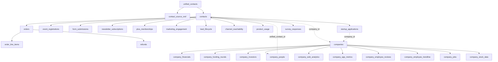

> **Every contact table joins to `contacts` via `unified_contact_id`.**
> **Every company table joins to `companies` via `company_id`.**
> **Contacts link to companies via `company_id` (many contacts → one company).**
> **Company people link back to contacts if they exist in the Inc42 ecosystem.**

---

## 3. Identity Resolution — The Hardest Problem

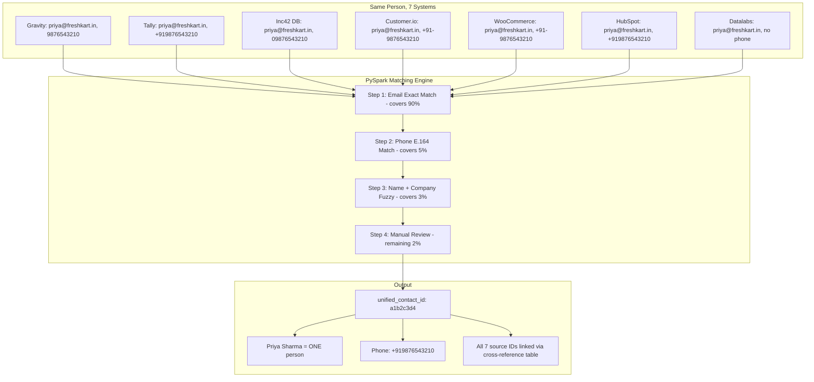

---

## 4. What We Build — Contact 360

> **One row = everything about a person. No more switching between 7 systems.**

### Example: Priya Sharma

| Category | Data | Source |
|----------|------|--------|
| **Identity** | Priya Sharma, priya@freshkart.in, +919876543210 | Resolved across all 7 systems |
| **Company** | FreshKart, D2C Personal Care, Seed stage, 8 Cr revenue | Datalabs |
| **Role** | Co-Founder & CEO, CXO seniority | HubSpot + Customer.io |
| **Plus Membership** | Annual member, started Jan 2025, expires Jan 2026, 303 days left, status: active | Inc42 DB + Customer.io |
| **Events** | Registered 3 (AI Summit, GenAI, D2CX), Attended 2, Cancelled 1 (D2CX, refund 2999) | Gravity + WooCommerce |
| **Orders** | 1 order — AI Workshop, net revenue 3,236 | WooCommerce |
| **Newsletters** | Subscribed to 5 (Daily, Weekly, AI Shift, InDepth, Markets), Unsubscribed from 1 (TheOutline) | Customer.io |
| **Email Health** | 15 sent, 12 opened, 5 clicked, 0 bounced | Customer.io |
| **Reachability** | Email + WhatsApp + Web Push + SMS (4 channels) | Customer.io |
| **Engagement** | Score: 78.5/100 | Computed from all sources |
| **Properties** | Touched 7 Inc42 properties: Plus, Daily NL, Weekly NL, AI Shift NL, Markets NL, AI Summit, Fast42 | Computed |
| **Lead Status** | Opportunity in HubSpot, score 82, owner: J. Singh | HubSpot |
| **First Seen** | June 12, 2024 via Daily Newsletter signup | Customer.io |

---

## 5. What We Build — Company 360

> **One row = everything about a company. Powered by Datalabs' 25+ tables.**

### Example: FreshKart Private Limited

| Category | Data | Source |
|----------|------|--------|
| **Profile** | FreshKart Private Limited, freshkart.in | Datalabs |
| **Sector** | Consumer Brands > D2C > Personal Care | Datalabs |
| **Stage** | Seed, Founded 2021, Bengaluru | Datalabs |
| **Founders** | Priya Sharma, Arjun Mehta (1 female founder) | Datalabs |
| **Revenue** | 8 Cr (220% YoY growth) | Datalabs MCA filings |
| **Profitability** | 42 lakh net profit, profitable, 5.2% net margin | Datalabs MCA filings |
| **Funding** | 1.2 Cr Seed from Titan Capital, AngelList India, 2AM VC | Datalabs |
| **Team** | 45 employees, growing 18% QoQ | Datalabs |
| **Hiring** | 3 open jobs: Marketing, Operations, Tech | Datalabs |
| **Web Traffic** | 285K monthly visits, 35% organic, 42.5% bounce rate | Datalabs |
| **App** | 4.3 rating, 500K downloads | Datalabs |
| **Employee Sentiment** | Glassdoor 3.8, CEO approval 85%, 72% recommend | Datalabs |
| **Inc42 Engagement** | 2 contacts in ecosystem, 1 Plus member, 1 order (4,999), Applied to Fast42 | Cross-referenced |

---

## 6. What We Build — Event + Revenue Intelligence

### Event Performance: AI Summit 2025

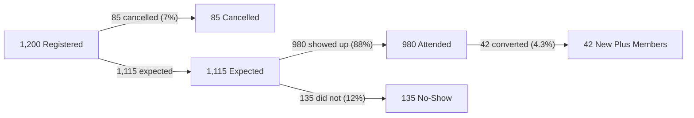

| Metric | Value |
|--------|-------|
| Total Registrations | 1,200 |
| Paid / Free / Speaker | 800 / 350 / 50 |
| Cancellations | 85 (7.1% rate) |
| Attendance | 980 (88% rate) |
| No-Shows | 135 (12.1% rate) |
| Gross Ticket Revenue | 45 lakh |
| Refunds | 3 lakh |
| **Net Ticket Revenue** | **42 lakh** |
| Avg Cancellation Timing | 12 days before event |
| Plus Conversions (within 30 days) | 42 (4.3% conversion) |
| Top Attending Sector | D2C Founders |

### Revenue: Plus Membership

| Metric | Value |
|--------|-------|
| MRR Trend | Growing 8% month over month |
| Annual vs Monthly Split | 70% annual, 30% monthly |
| Monthly Churn Rate | 5.2% |
| Top Conversion Source | AI Summit attendees |
| Average LTV | 12,999 |

---

## 7. What Happens When... (State Changes)

### Scenario 1: Newsletter Unsubscribe

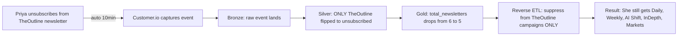

### Scenario 2: Event Cancellation + Refund

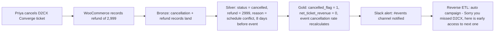

### Scenario 3: Plus Membership Cancellation

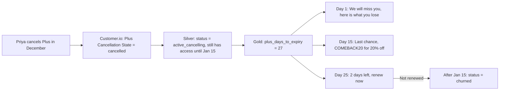

### Scenario 4: Email Hard Bounce

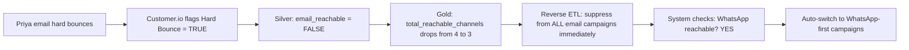

---

## 8. What It Enables

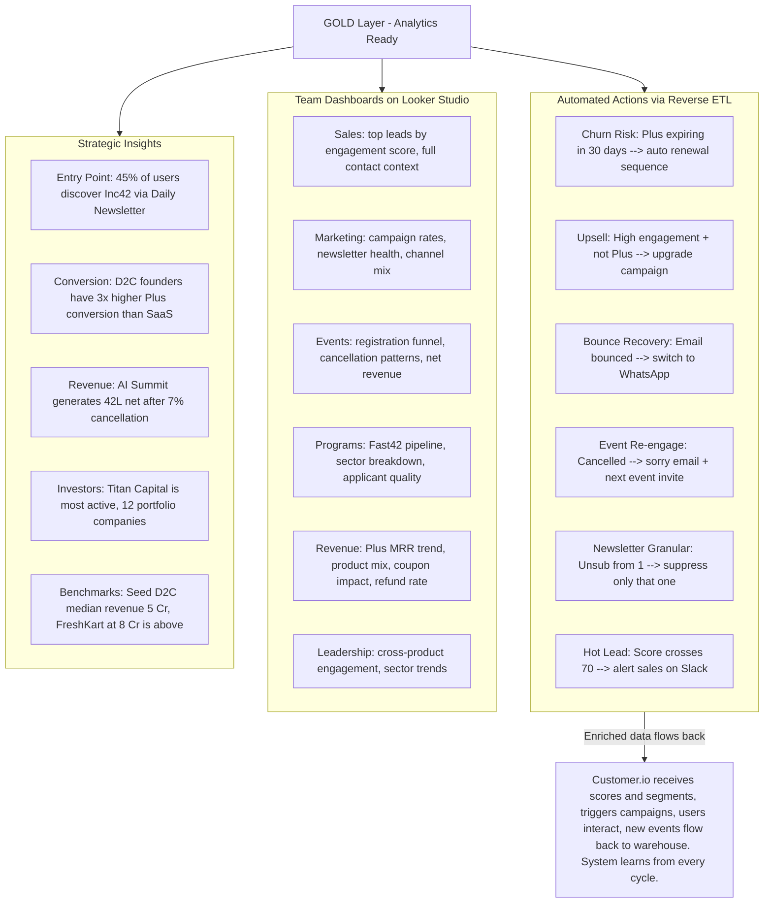

---

## 9. The Complete Pipeline — Orchestrated by Airflow

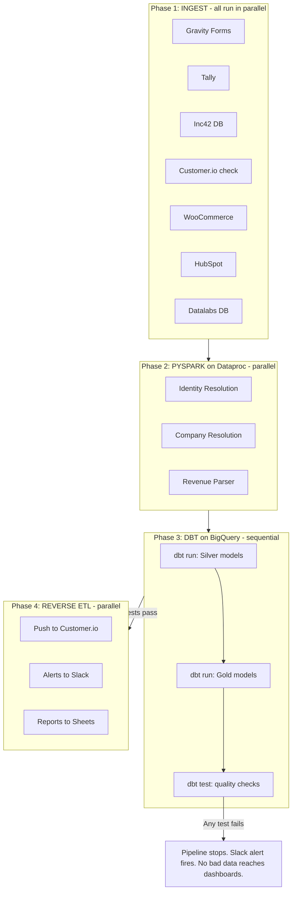

### Airflow manages:
- **Scheduling**: Daily at midnight IST (some ingestion runs more frequently)
- **Dependencies**: PySpark waits for all ingestion. dbt waits for PySpark. Reverse ETL waits for tests.
- **Retry**: If a task fails, auto-retry 3 times before alerting
- **Alerting**: Failed pipeline → Slack notification with error details
- **History**: Full log of every run — when it ran, how long it took, what failed

---

## 10. The Feedback Loop

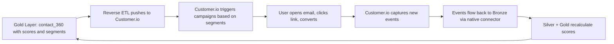

> **The warehouse gets smarter with every cycle.**
> Scores update daily. Segments refine automatically. Campaigns adapt. The system learns from every interaction.

---

## Tech Stack

| Tool | Purpose | Cost |
|------|---------|------|
| **BigQuery** | Data warehouse — stores Bronze, Silver, Gold | Free tier (10GB + 1TB queries/month) |
| **Google Cloud Storage** | File landing zone for raw exports | Free tier (5GB) |
| **Customer.io Connector** | Auto-syncs marketing data every 10 min | Included in Customer.io plan |
| **Airflow** | Orchestrates entire pipeline — scheduling, retries, dependencies, alerts | $7-15/month (GCP VM) |
| **dbt Core** | SQL transforms — Bronze to Silver to Gold | Free (open source) |
| **PySpark on Dataproc** | Identity resolution, fuzzy matching, revenue parsing | $1-3 per run |
| **Looker Studio** | Dashboards connected to BigQuery | Free (unlimited) |
| **GitHub** | Version control for all code and documentation | Free (private repos) |
| | **Total** | **Under $20/month** |

---

## Implementation Roadmap

| Phase | Duration | What Gets Built |
|-------|----------|-----------------|
| **Phase 1** | Week 1-2 | BigQuery setup, GCS bucket, first 2 ingestion pipelines (Inc42 DB + WooCommerce), basic Airflow DAG |
| **Phase 2** | Week 3-4 | Remaining 5 ingestion pipelines, Customer.io native connector, PySpark identity resolution |
| **Phase 3** | Week 5-8 | All Silver dbt models (30+ tables), Gold dimensions + facts, 360 views, data quality tests |
| **Phase 4** | Week 9-12 | Reverse ETL to Customer.io + Slack, Looker Studio dashboards, documentation, team onboarding |
